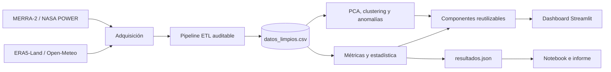
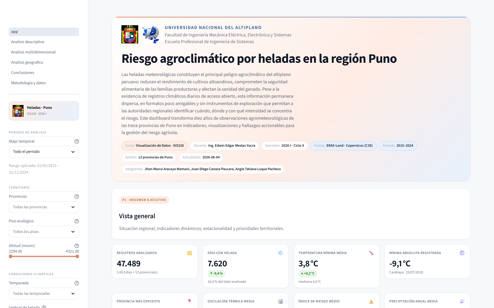
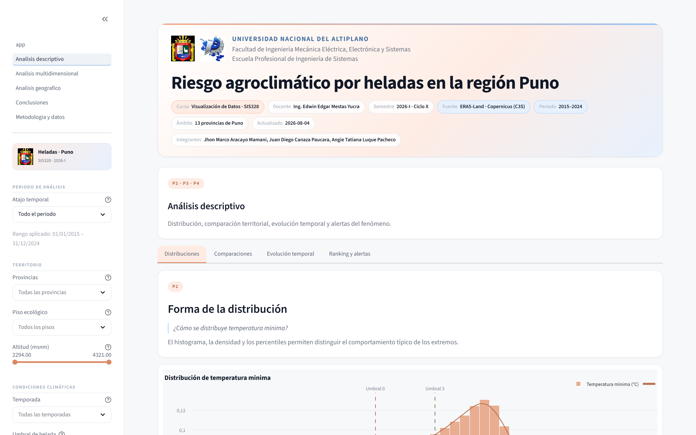
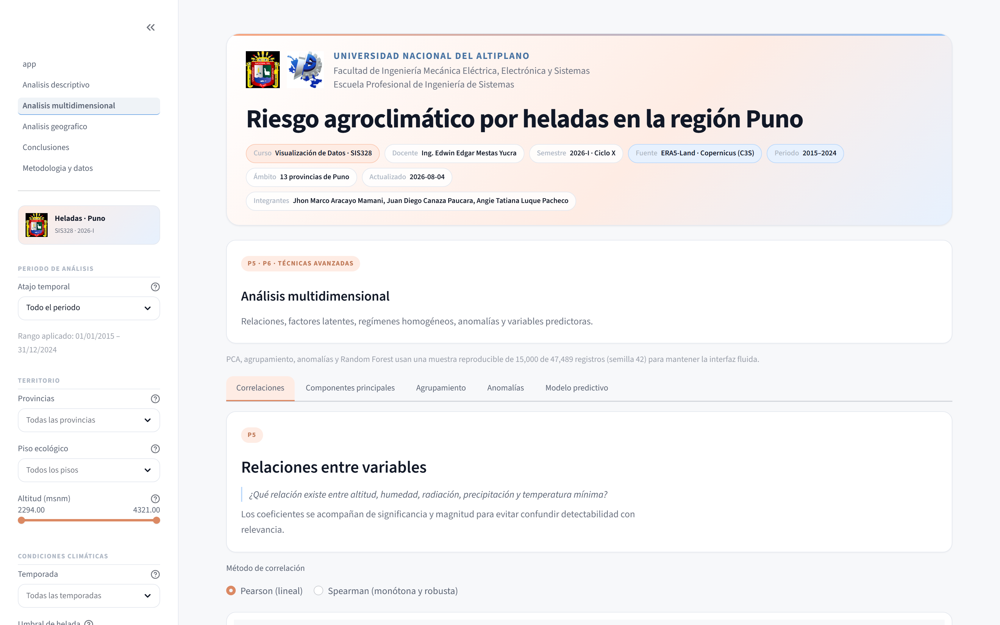
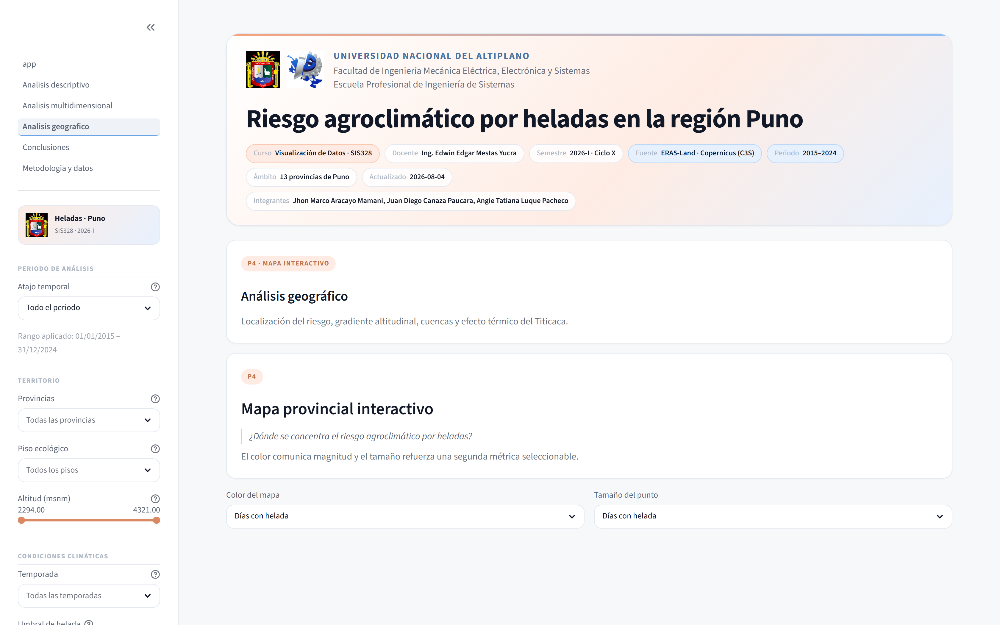
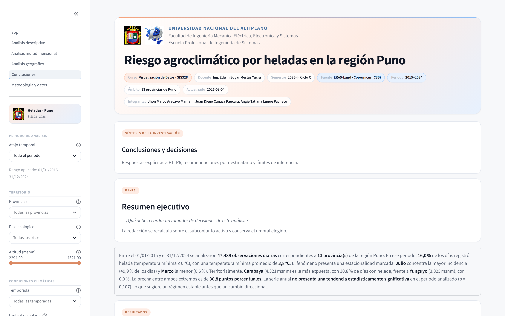
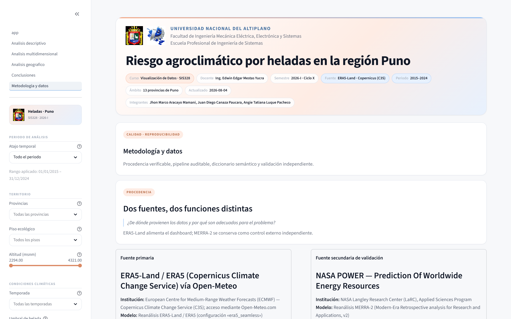
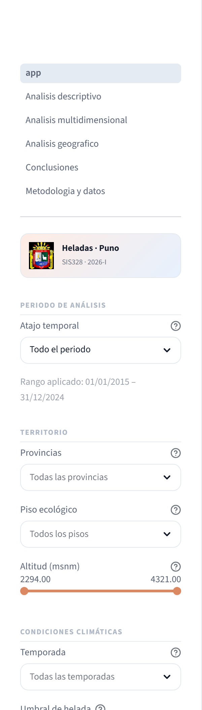
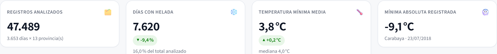

# Riesgo agroclimático por heladas en la región Puno

[](https://www.python.org/)
[](https://streamlit.io/)
[](https://plotly.com/python/)
[](data/datos_limpios.csv)
[](LICENSE)

Dashboard interactivo para explorar la frecuencia, intensidad, distribución territorial y factores asociados a las heladas en las trece provincias de la región Puno. Integra diez años de reanálisis ERA5-Land con una validación independiente MERRA-2 y transforma 47 489 observaciones diarias en indicadores, análisis estadístico y evidencia para la gestión del riesgo agrícola.

Proyecto final de **Visualización de Datos (SIS328)**, Escuela Profesional de Ingeniería de Sistemas de la Universidad Nacional del Altiplano, semestre 2026-I.

## Contenido

- [Problema y objetivos](#problema-y-objetivos)
- [Preguntas de análisis](#preguntas-de-análisis)
- [Características](#características)
- [Tecnologías](#tecnologías)
- [Arquitectura](#arquitectura)
- [Datos y procedencia](#datos-y-procedencia)
- [Metodología](#metodología)
- [Instalación](#instalación)
- [Configuración](#configuración)
- [Ejecución](#ejecución)
- [Reproducibilidad y pruebas](#reproducibilidad-y-pruebas)
- [Capturas](#capturas)
- [Resultados principales](#resultados-principales)
- [Informe y sustentación](#informe-y-sustentación)
- [Equipo](#equipo)
- [Licencia y créditos](#licencia-y-créditos)

## Problema y objetivos

Las heladas meteorológicas reducen el rendimiento de cultivos altoandinos, comprometen la seguridad alimentaria de familias productoras y afectan la sanidad del ganado. Aunque existen registros climáticos abiertos, su volumen y formato dificultan reconocer cuándo, dónde y con qué intensidad se concentra el peligro. El proyecto convierte esos registros en información comparable y accionable sin atribuir causalidad ni cambio climático más allá de lo que permiten los datos.

El objetivo general es diseñar un dashboard interactivo que caracterice el riesgo agroclimático por heladas en Puno durante 2015–2024. Los objetivos específicos son:

1. integrar y documentar dos fuentes climáticas verificables;
2. construir un pipeline auditable de limpieza y transformación;
3. comparar la incidencia temporal y territorial de las heladas;
4. identificar relaciones, agrupamientos y observaciones atípicas;
5. comunicar hallazgos, limitaciones y recomendaciones para la toma de decisiones.

## Preguntas de análisis

| Código | Pregunta | Sección | Método principal |
|---|---|---|---|
| P1 | ¿Cuál es la situación general del riesgo por heladas en Puno durante 2015–2024? | Vista general | KPI, resumen ejecutivo y perfil anual |
| P2 | ¿Cómo se distribuyen la ocurrencia e intensidad entre provincias y durante el año? | Análisis descriptivo | Barras, histograma, caja y mapa de calor |
| P3 | ¿Cómo evolucionó la frecuencia y existe una tendencia significativa? | Análisis descriptivo | Serie temporal, OLS, Mann-Kendall y Sen |
| P4 | ¿Qué provincias concentran el mayor y menor riesgo? | Descriptivo / geográfico | Ranking, mapa y alertas |
| P5 | ¿Cómo se relacionan altitud, humedad, radiación y precipitación con la mínima diaria? | Multidimensional | Dispersión, correlación y VIF |
| P6 | ¿Se identifican zonas homogéneas, factores latentes y días atípicos? | Multidimensional | PCA, K-Means, Ward, Isolation Forest y Random Forest |

## Características

- Ocho KPI recalculados con el periodo, territorio, piso ecológico, temporada, temperatura y umbral activos.
- Navegación multipágina con filtros compartidos y actualización automática de todos los módulos.
- Más de seis visualizaciones con propósito analítico: barras, líneas, histogramas, cajas, dispersión, calor, mapas y proyecciones multivariantes.
- Interpretaciones estructuradas en representación, patrón, hallazgo, decisión y limitación.
- Análisis de tendencia OLS y Mann-Kendall con corrección por empates y pendiente de Sen.
- PCA, K-Means, agrupamiento jerárquico de Ward, Isolation Forest y Random Forest.
- Validación cruzada ERA5-Land frente a MERRA-2.
- Descarga del subconjunto filtrado en CSV UTF-8 y Excel multihoja.
- Diseño pastel naranja/azul con contraste y separación cromática verificados.
- Resultados numéricos centralizados en [`report/resultados.json`](report/resultados.json).

## Tecnologías

| Tecnología | Versión mínima | Uso |
|---|---:|---|
| Python | 3.10 | Lenguaje base; compatible con Python 3.13 |
| Streamlit | 1.56.0 | Aplicación, estado y caché |
| Pandas / NumPy | 2.2.3 / 1.26.4 | Preparación y agregación tabular |
| Plotly / PyDeck | 6.7.0 / 0.9.2 | Gráficos y cartografía interactiva |
| SciPy | 1.15.3 | Inferencia, tendencias y contrastes |
| Scikit-learn | 1.7.0 | PCA, clustering, anomalías y clasificación |
| Matplotlib / Seaborn | 3.10.3 / 0.13.2 | Figuras estáticas del notebook |
| OpenPyXL / Kaleido | 3.1.5 / 0.2.1 | Exportación Excel y PNG |
| Jupyter / pytest | 1.1.1 / 8.2.2 | Análisis reproducible y pruebas |

Las versiones completas se encuentran en [`requirements.txt`](requirements.txt).

## Arquitectura

```text
dashboard-visualizacion/
├── app.py                         # entrada y vista general
├── pages/                         # módulos analíticos de Streamlit
├── components/                    # layout, KPI, gráficos y descargas
├── config/                        # configuración, dominio y tema visual
├── utils/                         # ETL, métricas, estadística y ML
├── scripts/                       # descarga, procesamiento y resultados
├── data/                          # datos originales, limpios y metadatos
│   └── raw/                       # respuestas íntegras de las API
├── notebooks/procesamiento.ipynb # limpieza y EDA ejecutados
├── assets/
│   ├── logos/                     # identidad institucional
│   └── capturas/                  # evidencia visual del dashboard
├── report/                        # fuente y resultados del informe
├── informe/                       # PDF técnico entregable
├── presentacion/                  # sustentación
├── tests/                         # pruebas funcionales
├── requirements.txt
└── README.md
```



La separación por capas evita que la interfaz replique reglas del dominio. `config/` es la fuente única de constantes; `utils/` no depende de la presentación; `components/` traduce resultados a elementos visuales; `pages/` compone las preguntas analíticas.

## Datos y procedencia

| Fuente | Papel | Resolución nominal | Cobertura usada |
|---|---|---:|---|
| ERA5-Land / ERA5, Copernicus C3S vía Open-Meteo | Fuente primaria del dashboard | 0,1° (aprox. 9 km) | 2015-01-01 a 2024-12-31 |
| MERRA-2, NASA POWER | Validación cruzada independiente | 0,5° × 0,625° (aprox. 55 × 65 km) | Mismo periodo y puntos |

La malla ERA5-Land se eligió porque distingue las capitales provinciales. Con MERRA-2, varias localidades vecinas caen en la misma celda y generan series idénticas; usarla como fuente principal introduciría agrupamientos y rankings espurios. MERRA-2 se conserva únicamente como contraste externo.

Artefactos incluidos:

- `data/datos_originales.csv`: 47 489 filas × 32 variables, preservadas con nomenclatura y unidades de origen;
- `data/datos_limpios.csv`: 47 489 filas × 52 variables, sin ausentes ni duplicados;
- `data/diccionario_datos.csv`: definición, unidad, origen y estadísticos de las 52 variables;
- `data/metadata.json`: procedencia, cobertura y bitácora completa del ETL;
- `data/raw/*.json`: respuestas originales de ambas API.

El diccionario se organiza en 11 variables temporales, 8 territoriales, 5 térmicas, 10 de humedad/precipitación, 6 de radiación/viento, 8 indicadores de helada y 4 campos de calidad/validación. No contiene información personal sensible.

Referencias principales en APA 7:

- Muñoz-Sabater, J., et al. (2021). ERA5-Land: A state-of-the-art global reanalysis dataset for land applications. *Earth System Science Data, 13*(9), 4349–4383. https://doi.org/10.5194/essd-13-4349-2021
- NASA Langley Research Center. (2025). *NASA Prediction Of Worldwide Energy Resources (POWER) Project: Daily agroclimatology data* (Version 2.9.6) [Conjunto de datos]. https://power.larc.nasa.gov/

## Metodología

| Etapa | Operación y criterio auditable |
|---:|---|
| 1 | Normalización de 19 nombres nativos y del esquema territorial |
| 2 | Conversión de la fecha ISO a tipo temporal |
| 3 | Homogeneización: km/h→m/s, hPa→kPa y segundos→horas |
| 4 | Detección de valores centinela `-999` |
| 5 | Validación de rangos físicos por variable |
| 6 | Verificación de coherencia mínima ≤ media ≤ máxima |
| 7 | Marcado, sin eliminación, de precipitación diaria superior a 100 mm |
| 8 | Control de unicidad de la clave `(provincia, fecha)` |
| 9 | Reindexación al calendario de 3 653 días × 13 provincias |
| 10 | Imputación por provincia sólo cuando existe ausencia |
| 11 | Integración de MERRA-2 por la clave territorial-temporal |
| 12 | Generación de 23 variables derivadas e índice de riesgo 0–100 |
| 13 | Orden, optimización de tipos y persistencia de bitácora y diccionario |

La radiación se conserva en **MJ/m²/día**. El control físico admite de 0 a 45 MJ/m²/día; este rango evita descartar observaciones válidas por confundir la unidad con kWh/m²/día. El único registro con precipitación superior a 100 mm se marca, se conserva y queda visible para el análisis de sensibilidad.

## Instalación

Se recomienda Python 3.13; el código también está probado con Python 3.10.

### Windows (PowerShell)

```powershell
git clone https://github.com/jhonaracayo/dashboard-heladas-puno.git
Set-Location dashboard-heladas-puno
py -3.13 -m venv .venv
.\.venv\Scripts\Activate.ps1
python -m pip install --upgrade pip
python -m pip install -r requirements.txt
python -m playwright install chromium
```

### Linux o macOS

```bash
git clone https://github.com/jhonaracayo/dashboard-heladas-puno.git
cd dashboard-heladas-puno
python3.13 -m venv .venv
source .venv/bin/activate
python -m pip install --upgrade pip
python -m pip install -r requirements.txt
python -m playwright install chromium
```

No se requieren credenciales: los artefactos de datos necesarios para ejecutar la aplicación están versionados. La zona horaria de agregación es `America/Lima` y la semilla analítica global es `42`.

## Configuración

- [`config/settings.py`](config/settings.py) concentra rutas, autores, fuentes, provincias, umbrales, periodo y preguntas de análisis.
- [`config/theme.py`](config/theme.py) define la paleta accesible, escalas y plantilla Plotly.
- [`.streamlit/config.toml`](.streamlit/config.toml) fija el tema del servidor y parámetros de ejecución.
- No se necesita un archivo `.env`. Si se añaden credenciales de despliegue, deben guardarse localmente en `.streamlit/secrets.toml`, que está excluido del repositorio.
- Los umbrales predeterminados son 0 °C para helada meteorológica y 3 °C para helada agronómica; el usuario puede alternarlos desde el dashboard.

## Ejecución

Para usar los datos incluidos y abrir el dashboard:

```bash
python scripts/03_generar_resultados.py
streamlit run app.py
```

Para reconstruir todo desde las fuentes públicas:

```bash
python scripts/01_descargar_datos.py
python scripts/02_procesar_datos.py
python scripts/03_generar_resultados.py
streamlit run app.py
```

La descarga consulta servicios externos y puede tardar varios minutos. El procesamiento y el análisis trabajan localmente. Por defecto, Streamlit abre `http://localhost:8501`.

Para regenerar las ocho capturas profesionales usadas por el informe:

```bash
python scripts/04_generar_capturas.py
```

Enlaces declarados para publicación:

- Repositorio: https://github.com/jhonaracayo/dashboard-heladas-puno
- Dashboard: https://dashboard-heladas-puno.streamlit.app

## Reproducibilidad y pruebas

`RANDOM_STATE = 42` controla PCA, K-Means, Isolation Forest, Random Forest y los muestreos usados para silueta. Las cifras que consume el informe se generan en un único contrato:

```bash
python scripts/03_generar_resultados.py
python -m jupyter nbconvert --to notebook --execute --inplace --ExecutePreprocessor.timeout=900 notebooks/procesamiento.ipynb
python -m pytest tests -q
```

Las pruebas comprueban requisitos del dataset, rango temporal de filtros, KPI, agregaciones, tendencias conocidas, dimensiones de PCA/K-Means y el rango del índice compuesto.

## Capturas

| Vista | Evidencia |
|---|---|
| Resumen ejecutivo y perfil regional |  |
| Distribuciones y tendencia |  |
| PCA, correlación y agrupamientos |  |
| Distribución territorial |  |
| Hallazgos y decisiones |  |
| Procedencia y bitácora |  |
| Filtros globales |  |
| Indicadores principales |  |

## Resultados principales

- Se identificaron **7 620 observaciones provincia-día con helada meteorológica (16,05 %)** y **18 877 con helada agronómica (39,75 %)**. El umbral agrícola amplía la exposición observada por un factor de aproximadamente 2,48.
- Carabaya concentró 1 126 días con helada; San Antonio de Putina, 976; El Collao, 962; y San Román, 930. Sandia y Yunguyo no registraron heladas meteorológicas en el punto de malla analizado.
- El gradiente provincial fue de **−0,428 °C por cada 100 m** de altitud (`R² = 0,705`, `p = 0,00033`). Sin embargo, Yunguyo y San Román se ubican cerca de 3 825 m y muestran 0 frente a 930 días, evidencia de que la cercanía al lago y otros controles locales impiden zonificar sólo por altitud.
- Entre 2015 y 2024 no se detectó una tendencia estadísticamente significativa en heladas: OLS estimó −1,37 días por provincia y año (`p = 0,132`) y Mann-Kendall obtuvo `p = 0,107`. Diez años no permiten atribuir cambio climático.
- CP1 explicó 48,2 % y CP2 20,5 % de la varianza; cinco componentes alcanzaron 90 %. K-Means seleccionó tres grupos con silueta 0,306, por lo que la estructura se interpreta como débil y no como fronteras climáticas rígidas.
- Isolation Forest marcó 475 observaciones (1 %) para revisión. El Random Forest, con partición temporal y sin usar la temperatura mínima que define el objetivo, obtuvo AUC ROC 0,990 y sensibilidad 0,945; se usa para interpretar factores asociados, no como pronóstico operativo.
- ERA5-Land y MERRA-2 mostraron `r = 0,6106`, sesgo medio de `+1,288 °C` y concordancia de helada de `83,06 %`. La señal es consistente entre productos, aunque los valores puntuales deben leerse según su resolución.

## Técnicas avanzadas

| Técnica | Propósito | Salvaguarda de interpretación |
|---|---|---|
| PCA estandarizado | Resumir 12 variables en factores latentes | Se reportan varianza, cargas y VIF |
| K-Means | Explorar regímenes diarios semejantes | `k` se elige por silueta y se declara su calidad |
| Ward jerárquico | Comparar perfiles de las 13 provincias | Se aplica a agregados territoriales legibles |
| Isolation Forest | Detectar combinaciones multivariantes atípicas | No elimina datos; sólo los marca |
| Random Forest | Ordenar factores asociados a la helada | Partición temporal, importancia por permutación y sin fuga del objetivo |
| OLS + Mann-Kendall/Sen | Contrastar tendencia lineal y monótona | Se informan `p`, intervalo y coincidencia entre métodos |

## Informe y sustentación

El informe técnico se organiza en portada e índices; resumen y abstract; introducción; problema; objetivos; descripción de las fuentes; metodología ETL; arquitectura y UX/UI; resultados por las preguntas P1–P6; capturas; conclusiones; recomendaciones; limitaciones; referencias APA 7 y anexos de reproducibilidad. El PDF entregable se ubica en `informe/Informe_Tecnico_Heladas_Puno.pdf`; la presentación se encuentra en `presentacion/sustentacion.pdf` y el reparto oral de 10 minutos en [`presentacion/GUION_SUSTENTACION.md`](presentacion/GUION_SUSTENTACION.md).

## Equipo

| Integrante | Rol | Aportes principales |
|---|---|---|
| **Aracayo Mamani, Jhon Marco** | Arquitectura y dashboard | Capas, componentes, filtros, exportación e integración |
| **Canaza Paucara, Juan Diego** | Ingeniería de datos y análisis multivariante | Adquisición, ETL, PCA, clustering y anomalías |
| **Luque Pacheco, Angie Tatiana** | Visualización, estadística y redacción | Sistema visual, gráficos, tendencias e informe |

Docente: **Ing. Edwin Edgar Mestas Yucra**.

## Licencia y créditos

El código se distribuye bajo la [Licencia MIT](LICENSE). Los datos mantienen las condiciones de sus productores: Copernicus C3S/ECMWF con atribución y NASA POWER como datos públicos. El software no sustituye alertas oficiales de SENAMHI ni mediciones de estaciones meteorológicas de superficie.
